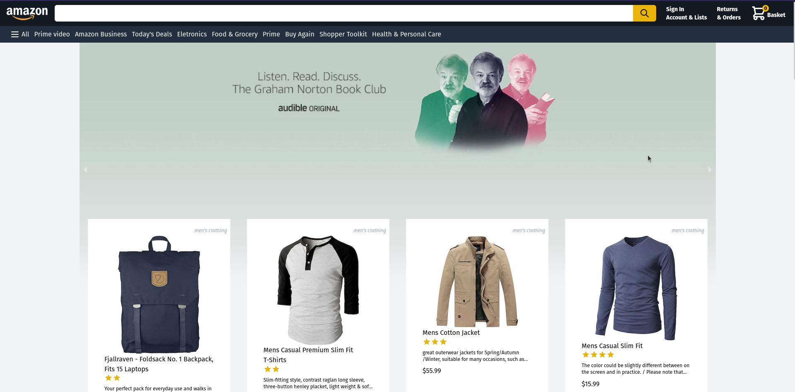

<br/>

<h4 align="center"> 
	🚧  Em construção...  🚧
</h4>

<br/>

# Amazon 2.0 (Amazon Clone)

<span id="sobre-o-projeto" ></span>


## 🖥️ Sobre o projeto
=================

Este projeto é um pequeno clone do grandioso site da Amazon. Assim sendo ele trás um layout muito semelhante (porém não idêntico) ao site original.
Trás também algumas das funcionalidades mais básicas do site original.

Nesta aplicação web o usuário terá acesso a um catálago produtos disponíveis para comprra e poderá realizar as seguintes ações:

* Filtrar a listagem de produtos atráves de botões
* Adicionar um item de cada vez no carrinho
* Remover um item de cada vez no carrinho.
* Fazer login com uma conta Google
* Realizar uma compra através de uma integração com Stripe
* Ter acesso ás compras anteriores atravez de uma conexão com banco de dados do Firebase


<span id="tabela-de-conteudo" ></span>

## 📋 Tabela de conteúdos
=================
<!--ts-->
   * [Sobre o Projeto](#sobre-o-projeto)
   * [Tabela de Conteúdos](#tabela-de-conteudo)
   * [Tecnologias](#tecnologias)
   * [Pré-requisitos](#pre-requisitos)
   * [Como rodar a aplicação web](##como-rodar-a-aplicacao-web)
<!--te-->

<span id="tecnologias" ></span>

## ⚒️ Tecnologias
=================

As seguintes ferramentas foram usadas na construção do projeto:
<ul>
  <li> <a href='https://nextjs.org/' target='_blank'> Next </a></li>
  <li> <a href='https://www.typescriptlang.org/' target='_blank'> Typescript </a></li>
  <li> <a href='https://tailwindcss.com/' target='_blank'> Tailwindcss </a></li>
  <li> <a href='https://console.firebase.google.com' target='_blank'> Firebase </a></li>
  <li> <a href='https://console.firebase.google.com' target='_blank'> NextAuth </a></li>
   <li> 
    <a href='https://redux.js.org/' target='_blank'> Redux /  </a> 
    <a href='https://redux-toolkit.js.org/' target='_blank'> @reduxjs/tolkit </a> 
  </li>
  <li> <a href='https://stripe.com/' target='_blank'> Stripe </a></li>

  <li>
    <div>
      Algumas bibliotecas/frameworks utilizados:
      <ul>
        <li>
          <a href='https://axios-http.com/ptbr/' target='_blank'>axios</a>
        </li>
        <li>
          <a href='https://momentjs.com/' target='_blank'>moment </a>
        </li>
        <li>
          <a href='https://www.npmjs.com/package/react-currency-formatter' target='_blank'>React Currency Formatter </a>
        </li>
        <li>
          <a href='https://github.com/tailwindlabs/tailwindcss-line-clamp' target='_blank'>@tailwindcss/line-clamp </a>
        </li>
        <li>
          <a href='https://react-responsive-carousel.js.org/' target='_blank'>react-responsive-carousel </a>
        </li>
        <li>
          <a href='https://heroicons.com/' target='_blank'>Heroicons </a>
        </li>
      </ul>
    </div>
  </li>
</ul>

<span id='pre-requisitos'></span>

## ✅ Pré-requisitos
=================

Antes de começar, você vai precisar ter instalado em sua máquina as seguintes ferramentas:
* [Git](https://git-scm.com)
* [Node.js (v18.12.0)](https://nodejs.org/en/)
* [VSCode](https://code.visualstudio.com/) (Editor sugerido)

## ⚙️ Como rodar a aplicação web
=================

<span id='como-rodar-a-aplicacao-web'></span>

## ⚙️ Como rodar a aplicação
=================

```bash
# Clone este repositório
$ git clone https://github.com/jp2mesquita/amazon-clone-jp2mesquita-
```

Em seguida configure as variáveis de ambiente para que a aplicação funcione.

Mas para conseguir as variáveis como as que estão no arquivo .env.example é preciso configurar um projeto no Firebase, configurar a autenticação com o Google e ainda configurar uma conta no Stripe. 

Para isso vou deixar dois links que podem ser úteis para conseguir realizar estas etapas.

<a href='https://mixed-snapper-bd4.notion.site/Google-Authentication-com-Firebase-e-NextAuth-93fc15a5cc664ec2bb841eaa01d8e372'> 
  Como configurar autenticação com firebase e google
</a> 

</br>


Depois de conseguir as variáveis de ambiente é hora de rodar a versão Web

```bash
#Acesse a pasta amazon-clone no terminal/cmd, instale as dependências e rode o projeto

$ npm install
$ npm run dev

```


</br>

## 🧔 Autor
=================

<a href="https://blog.rocketseat.com.br/author/thiago/">
 
 <br />
Desenvolvido com 💜 por João Paulo Mesquita

<br/>

[](https://www.linkedin.com/in/jo%C3%A3o-paulo-mesquita-02a4a3179/)  [](mailto:jp-mesquita@live.com)

